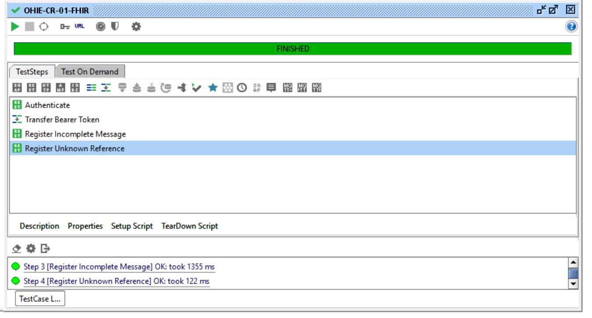
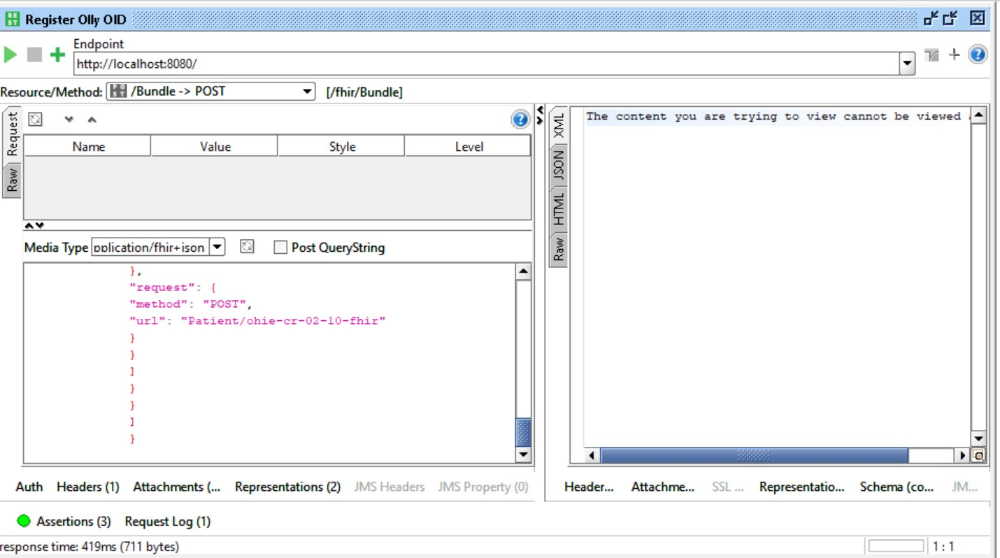

# FHIR Test Cases Instructions



## Install SoapUI:

Download and install soapui (a testing tool for SOAP and REST APIs): [https://www.soapui.org/tools/soapui/](https://www.soapui.org/tools/soapui/)

## Pull santempi:

Pull santempi repository from github : [https://github.com/santedb/santempi.git](https://github.com/santedb/santempi.git)

## Install docker containers:

Having docker installed, run the following command inside santempi/instant directory where the docker-compose.yml file exists to spin up docker containers.

```
docker compose -f docker-compose.yml up
```


It can also be done by running the "docker-compose.ui.yml"  file but the ui component is not necessary here


## Run the test cases with SoapUI:

Import FHIR test cases which are located at santempi/SanteMPI-Test-Cases-soapui-project.xml.

They can be run as an entire test suite

.jpg>)

&#x20;or an individual test case



&#x20;or test step.




Keep in mind that some test steps need to run in sequence in order to pass


