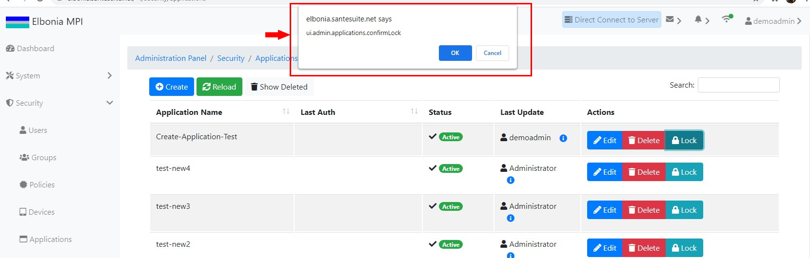

# TEST: SECURITY-AM-02

## References

* [Application Management](broken-reference)

## Discussion

This is a basic test to demonstrate that the UI components appear and operate correctly when locking an existing application.

## **Pre-Conditions / Setup**

1. User must be logged into an account with policies granted for locking applications.
2. Navigate to **Administration Panel / Security / Applications / List**.

## Actions/Steps

1- Click the **Lock** button

.jpg>)

2- Click  **Ok** to confirm the lock.

.jpg>)

## Expected Behaviour

1- Should display a message asking to confirm the lock.

2- Should appear the Status of the application changed to locked.

.jpg>)
