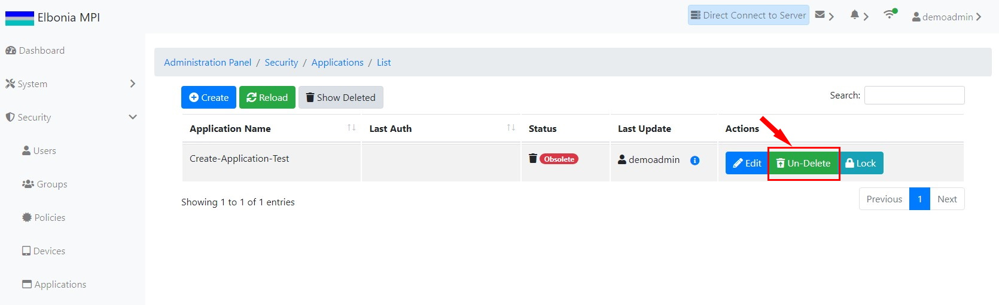
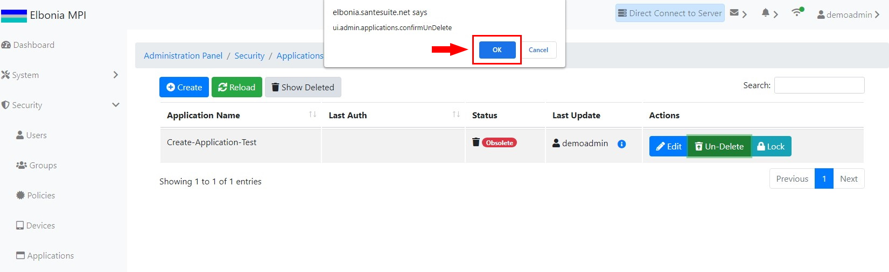
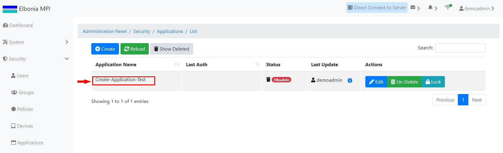
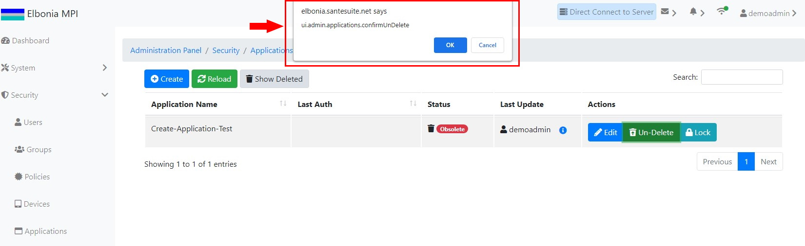
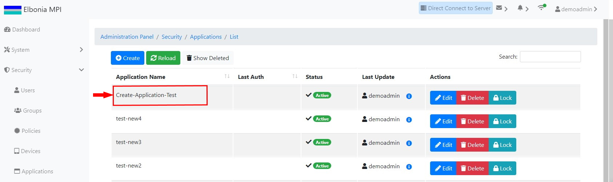

# TEST: SECURITY-AM-05

## References

* [Application Management](broken-reference)

## Discussion

This is a basic test to demonstrate that the UI components appear and operate correctly when undeleting  a deleted application.

## Pre-Conditions / Setup

1. User must be logged into an account with policies granted for undeleting applications.
2. Navigate to **Administration Panel / Security / Applications / List**.

## Actions/Steps

1- Navigate to the Applications/List page and click the **Show Deleted** button

.jpg>)

2- Click the **Un-Delete** button to undelete the application

3- Click  **Ok** to confirm the undelete.

## Expected Behaviour

1- Deleted application ( Create-Application-Test ) should appear among the deleted applications

2- Should display a message asking to confirm the undelete.

3-

* The undeleted application (Create-Application-Test ) should disappear from the deleted applications list page&#x20;
* The undeleted application (Create-Application-Test) should reappear on the Applications/List page.

