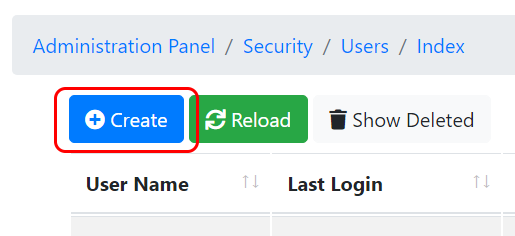

# TEST: SECURITY-UM-01

## References

* [User Management](broken-reference)

## Discussion

This is a basic test to demonstrate that the UI components appear and operate correctly when creating new users on the [User Management](broken-reference) page.

## Pre-Conditions / Setup

1. User must be logged into an account with policies granted for creating users.
2. Navigate to **Administration Panel / Security / Users / Index**.


Each of the tabs below (corresponding to a form section) contain a table that summarizes valid possible values for the form to create a new user.




| Label        | Value                |
| ------------ | -------------------- |
| **Username** | ClinicalStaffUser123 |



| Label                | Value           |
| -------------------- | --------------- |
| **Role**             | CLINICAL\_STAFF |
| **New Password**     | Clinic@l123     |
| **Confirm Password** | Clinic@l123     |



| Label                  | Value                               |
| ---------------------- | ----------------------------------- |
| **Security E-mail**    | clinical\_staff@user.com            |
| **Security Phone**     | 519-203-8190                        |
| **Given Name**         | John                                |
| **Family Name**        | Doe                                 |
| **Preferred Language** | English                             |
| **Primary Facility**   | Muddy District Distribution Centre  |
| **Employer**           | Muddsville Central Hospital Network |



## Actions/Steps

&#x20;   1\. Click the **Create** button to navigate from **Administration Panel / Security / Users / Index** to **Administration Panel / Security / Users / Create User**.

&#x20;

&#x20;   2\. Enter valid text into the **Core Properties** drop-down form group.

&#x20;   3\. Enter valid text into the **Security Properties** drop-down form group.

&#x20;   4\. Enter valid text into the **Demographic Properties** drop-down form group.

&#x20;   5\. Click the **Save** button.

&#x20;   &#x20;

## Expected Behaviour

* Automatically navigate to the **Administration Panel / Security / Users / Index** page.
* Momentarily display success message in top right corner: &#x20;
* New user (**ClinicalStaffUser123**) should appear in the table of users on the Index page with properties matching those in the "Pre-Conditions / Setup" above.

