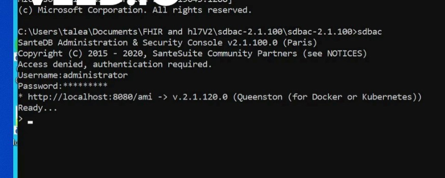

# HL7v2 Test Cases Instructions



## Pull santempi:

Pull santempi repository from github : [https://github.com/santedb/santempi.git](https://github.com/santedb/santempi.git)

## Install docker containers:

Having docker installed, run the following command inside santempi/instant directory where the docker-compose.yml file exists to spin up docker containers.

```
 docker compose -f docker-compose.yml up
```


It also can be done by running the "docker-compose.ui.yml" file but the ui component is not necessary here



## Get sdbac(santedb admin console) from latest release

Get the latest sdbac release from github: [https://github.com/santedb/santedb-server/releases](https://github.com/santedb/santedb-server/releases)

Download the sdbac.zip and extract the files.&#x20;

## Configure santempi instances for pre-conditions setup

1-Run the following commands inside sdbac directory where the sdbac.exe is located or run the sdbac.exe directly.


The command prompt should be run in administrative mode


```
sdbac
```

2-Insert the credentials for Username and Password.

3-Wait for the system to get ready



4-Run the following commands:

**To create TEST\_HARNESS application run:**

```
application.add TEST_HARNESS -s TEST_HARNESS
```

**To create TEST\_HARNESS|TEST device run:**

```
device.add TEST_HARNESS|TEST -s TEST_HARNESS
```

**To create TEST identity domain and set the assigned authority to TEST\_HARNESS run:**

```
aa.add -n TEST -o 2.16.840.1.113883.3.72.5.9.1 -u http://ohie.org/test/test -d 'OpenHIE Test Domain' -a TEST_HARNESS
```

.jpg>)

## Pull hl7-testing-tool:

Pull hl7-testing-tool from github: [https://github.com/santedb/hl7-testing-tool.git](https://github.com/santedb/hl7-testing-tool.git)

## Run hl7-testing-tool:

Run hl7-testing-tool solution with visual studio.

They can be run as an entire test suite or an individual test case or test step.

For a test step to pass all  mandatory assertions and at least one of alternate assertions for the same terserstring must pass.


For more information about how the tool works please visit The README section in hl7-testing-tool repository at github: [https://github.com/santedb/hl7-testing-tool/blob/main/README.md](https://github.com/santedb/hl7-testing-tool/blob/main/README.md)


