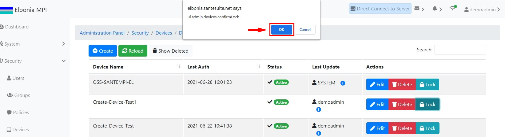

# TEST: SECURITY-DM-02

## References

* [Device Management](broken-reference)

## Discussion

This is a basic test to demonstrate that the UI components appear and operate correctly when locking an existing device.

## **Pre-Conditions / Setup**

1. User must be logged into an account with policies granted for locking devices.
2. Navigate to **Administration Panel / Security / Devices / Devices**.

## Actions/Steps

1- Click the **Lock** button.

.jpg>)

2- Click  **Ok** to confirm the lock.

## Expected Behaviour

1- - Should display a message asking to confirm the lock.

.jpg>)

2- Should appear the Status of the device changed to locked.

.jpg>)
