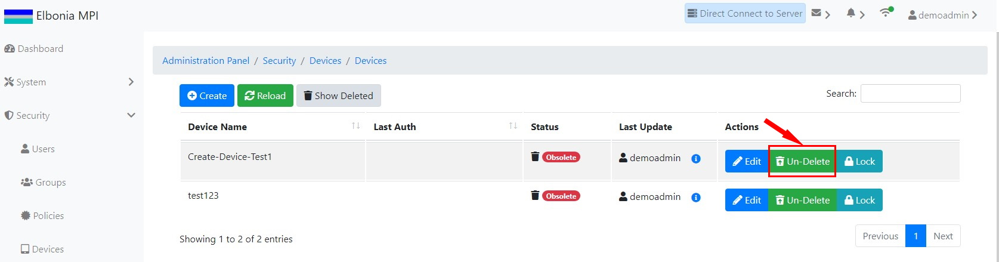

# TEST: SECURITY-DM-05

## References

* [Device Management](broken-reference)

## Discussion

This is a basic test to demonstrate that the UI components appear and operate correctly when undeleting  a deleted device.

## **Pre-Conditions / Setup**

1. User must be logged into an account with policies granted for undeleting devices.
2. Navigate to **Administration Panel / Security / Devices / Devices**.

## Actions/Steps

1- Navigate to the Devices/Devices page and click the **Show Deleted** button.

.jpg>)

2- Click the **Un-Delete** button to undelete the device.

3- Click  **Ok** to confirm the undelete.

.jpg>)

## Expected Behaviour

1- Deleted device ( Create-Device-Test1 ) should appear among the deleted applications.

.jpg>)

2- Should display a message asking to confirm the undelete.

.jpg>)

3-

* The undeleted device (Create-Device-Test1 ) should disappear from the deleted devices list page&#x20;
* The undeleted device (Create-Device-Test1) should reappear on the Devices/Devices page.

.jpg>)
