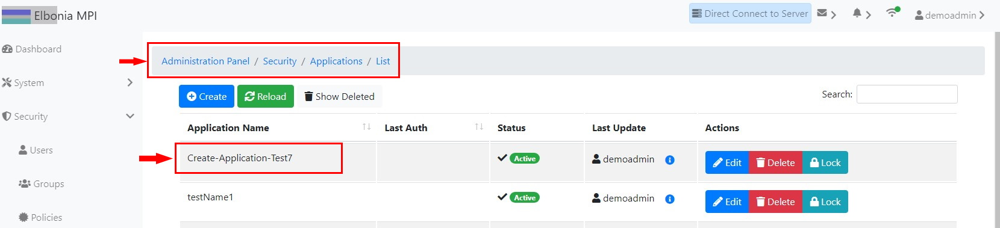

# TEST: SECURITY-AM-01

## References

* [Application Management](broken-reference)

## Discussion

This is a basic test to demonstrate that the UI components appear and operate correctly when creating a new application.

## **Pre-Conditions / Setup**

1. User must be logged into an account with policies granted for creating applications.
2. Navigate to **Administration Panel / Security / Applications / List**.

## Actions/Steps

1- Click the **Create** button &#x20;

.jpg>)

2- Fill out the fields appropriately and click the **Save** button. (Name field is a required field and MUST be filled )

.jpg>)

## Expected Behaviour

1- Should navigate to the new Create Application page.

.jpg>)

2-

* Should momentarily display success message in the top right corner
* When navigating to the Applications/List page, Should appear New Application(**Create-Application-Test7**) **** in the list of applications.

.jpg>)

