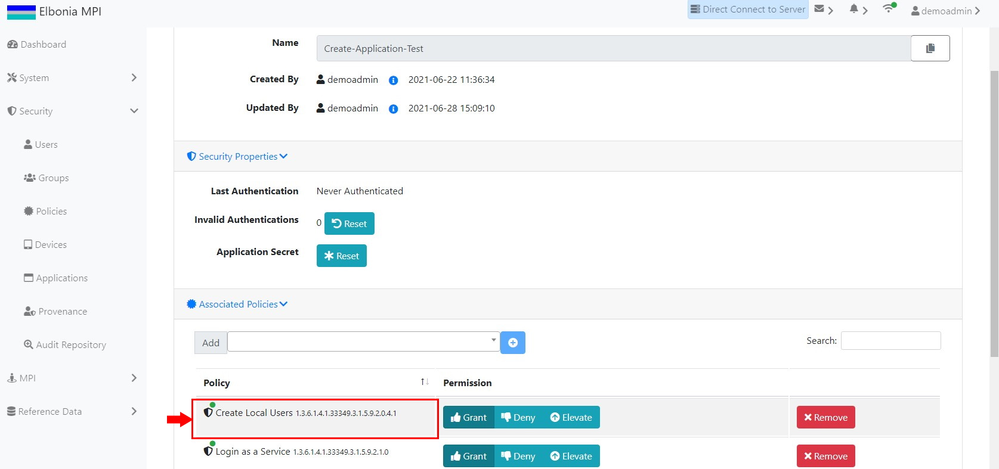

# TEST: SECURITY-AM-06

## References

* [Application Management](broken-reference)

## Discussion

This is a basic test to demonstrate that the UI components appear and operate correctly when assigning a policy to an existing application.

## Pre-Conditions / Setup

1. User must be logged into an account with policies granted for assigning policies to applications.
2. Navigate to **Administration Panel / Security / Applications / List**.

## Actions/Steps

1- Click the **Edit** button.

.jpg>)

2- Choose the to be added policy ( for example: Create Local Users ) from the dropdown list and click the **+** button.

.jpg>)

## Expected Behaviour

1- Should navigate to the Applications/Edit Application page.

.jpg>)

2- Assigned policy ( Create Local Users ) should appear under the Associated Policies tab.

