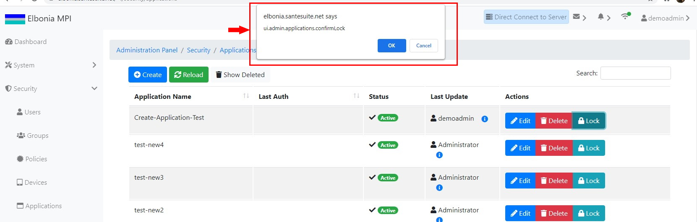
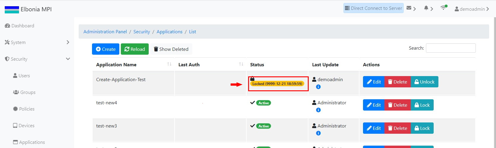

# TEST: SECURITY-AM-02

## References

* [Application Management](../../../../operations/security-administration/end-user-guide/application-management.md)

## Discussion

This is a basic test to demonstrate that the UI components appear and operate correctly when locking an existing application.

## Pre-Conditions / Setup

A user should have been logged in and have the right to lock an application.

## Actions/Steps

1- Click the **Lock** button

2- Click  **Ok** to confirm the lock.

## Expected Behaviour

1- Should display a message asking to confirm the lock.

2- Should appear the Status of the application changed to locked.

