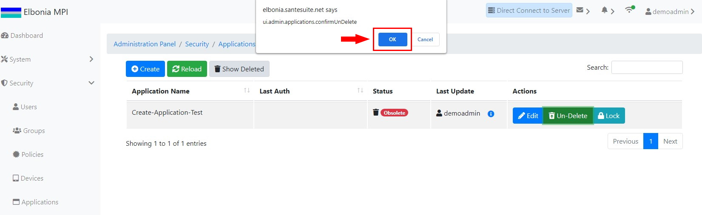
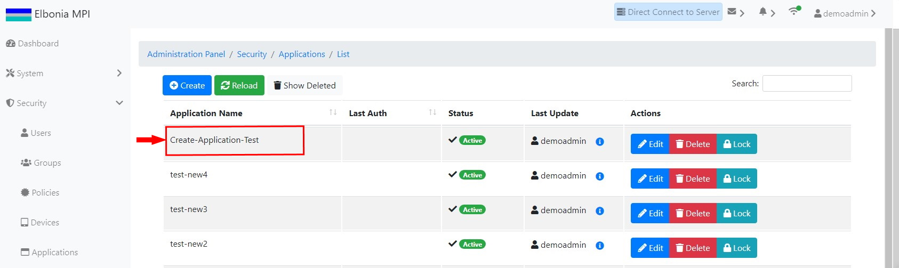

# TEST: SECURITY-AM-05

## References

* [Application Management](../../../../operations/security-administration/application-management.md)

## Discussion

This is a basic test to demonstrate that the UI components appear and operate correctly when undeleting  a deleted application.

## Pre-Conditions / Setup

 A user should have been logged in and have the right to delete an application.

## Actions/Steps

1- Navigate to the applications list page and click the **Show Deleted** button

2- Click the **Un-Delete** button to undelete the application

3- Click  **Ok** to confirm the undelete.

## Expected Behaviour

1- Deleted application \( Create-Application-Test \) should appear among the deleted applications

2- Should display a message asking to confirm the undelete.

3-

* The undeleted application \(Create-Application-Test \) should disappear from the deleted applications list page 
* The undeleted application \(Create-Application-Test\) should reappear on the applications list page.

