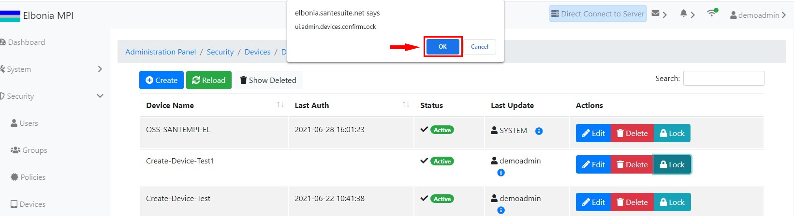

# TEST: SECURITY-DM-02

## References

* [Device Management](../../../../operations/security-administration/device-management.md)

## Discussion

This is a basic test to demonstrate that the UI components appear and operate correctly when locking an existing device.

## Pre-Conditions / Setup

A user should have been logged in and have the right to lock a device.

## Actions/Steps

1- Click the **Lock** button.

2- Click  **Ok** to confirm the lock.

## Expected Behaviour

1- - Should display a message asking to confirm the lock.

2- Should appear the Status of the device changed to locked.

