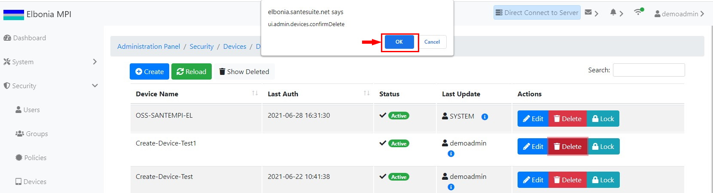

# TEST: SECURITY-DM-04

## References

* [Device Management](../../../../operations/security-administration/device-management.md)

## Discussion

This is a basic test to demonstrate that the UI components appear and operate correctly when deleting an existing device.

## Pre-Conditions / Setup

A user should have been logged in and have the right to delete a device.

## Actions/Steps

1- Click the **Delete** button.

2- Click  **Ok** to confirm the delete.

## Expected Behaviour

1- Should display a message asking to confirm the delete.

2- Deleted device \(Create-Device -Test1\) Should disappear from the Devices/Devices page.

