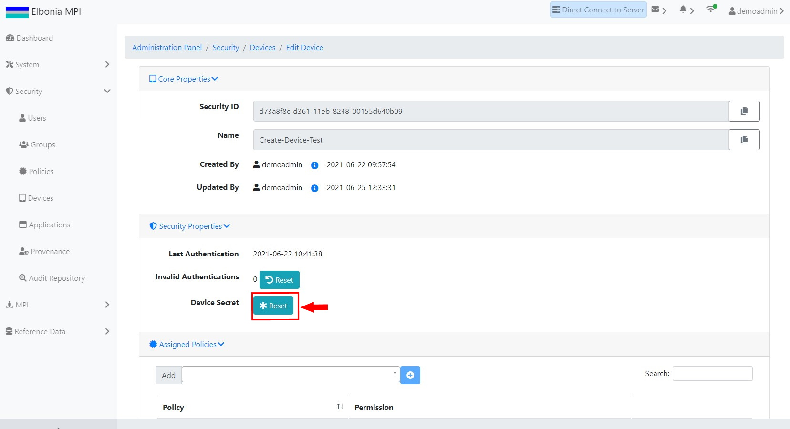
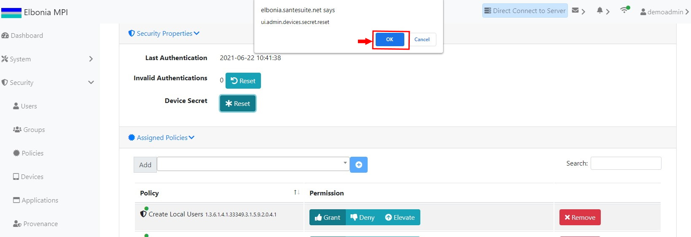
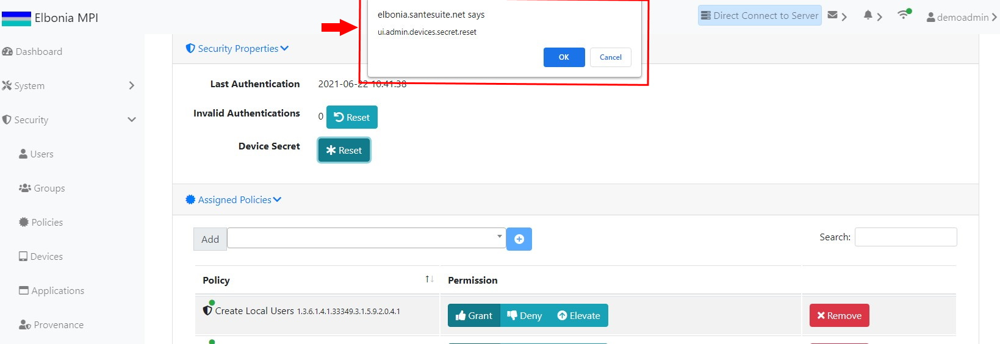

# TEST: SECURITY-DM-07

## References

* [Device Management](../../../../../operations/security-administration/device-management.md)

## Discussion

This is a basic test to demonstrate that the UI components appear and operate correctly when resetting a device's secret.

## Pre-Conditions / Setup

 A user should have been logged in and have the right to change a device secret.

## Actions/Steps

1- Click the **Edit** button.

2- Under the Security Properties tab, click the Device Secret **Reset** button.

3- Click  **Ok** to confirm the secret reset.

## Expected Behaviour

1- Should navigate to the Devices/Edit Device page

2- Should display a message asking to confirm the secret reset.

3- Should display the new Device Secret.

