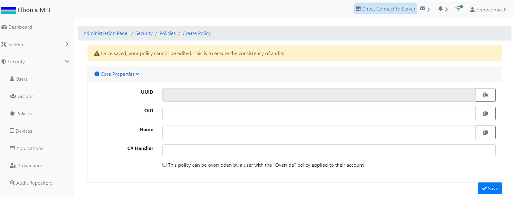

# TEST: SECURITY-PM-01

## References

* [Security Policy Management](../../../../../operations/security-administration/security-policy-management.md)

## Discussion

This is a basic test to demonstrate that the UI components appear and operate correctly when creating a new policy.

## Pre-Conditions / Setup

1. User must be logged into an account with policies granted for creating policies.
2. Navigate to **Administration Panel / Security / Policies / Index**.

## Actions/Steps

1- Click the **Create** button  

2- Fill out the fields appropriately and click the Save button.\(keep in mind that  OID field and Name field are required fields \) 

## Expected Behaviour

1- Should navigate to the new Create Policy page.

2-

* Should navigate to Policy Management Index page.
* Should momentarily display success message in the top right corner
* Should appear New Policy\(**Create-Policy-Test**\) **** in the table of policies on the Index page with properties matching those put in the form required to create a new policy.

    

