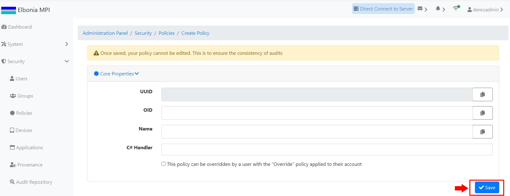

# TEST: SECURITY-PM-02

## References

* [Security Policy Management](../../../../../operations/security-administration/security-policy-management.md)

## Discussion

This is a basic test to demonstrate that the UI components appear and operate correctly when creating a new policy leaving the OID and Name fields blank.

## Pre-Conditions / Setup

1. User must be logged into an account with policies granted for creating policies.
2. Navigate to **Administration Panel / Security / Policies / Index**.

## Actions/Steps

1- Click the **Create** button 

2- Leave OID filed and Name field blank and click the **Save** button.\( OID field and Name field are required fields \) 

## Expected Behaviour

1- Should navigate to the new Create Policy page.

2- Should show an error message below OID field and Name field indicating that required field is missing.

 

