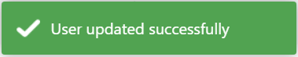

# TEST: SECURITY-UM-01

## References

* [User Management](../../../../../operations/security-administration/user-management.md)

## Discussion

This is a basic test to demonstrate that the UI components appear and operate correctly when creating new users on the [User Management](../../../../../operations/security-administration/user-management.md) page.

## Pre-Conditions / Setup

Each of the tabs below \(corresponding to a form section\) contain a table that summarizes valid possible values being input in the form required to create a new user.



| Label | Value |
| :--- | :--- |
| **Username** | ClinicalStaffUser123 |



| Label | Value |
| :--- | :--- |
| **Role** | CLINICAL\_STAFF |
| **New Password** | Clinic@l123 |
| **Confirm Password** | Clinic@l123 |



| Label | Value |
| :--- | :--- |
| **Security E-mail** | clinical\_staff@user.com |
| **Security Phone** | 519-203-8190 |
| **Given Name** | John |
| **Family Name** | Doe |
| **Preferred Language** | English |
| **Primary Facility** | Muddy District Distribution Centre |
| **Employer**  | Muddsville Central Hospital Network |



## Actions/Steps

## Expected Behaviour

* Navigate to User Management Index page.
* Momentarily display success message in top right corner:  
* New user \(**ClinicalStaffUser123**\) ****should appear in the table of users on the Index page with properties matching those in the "Pre-Conditions / Setup" above.

