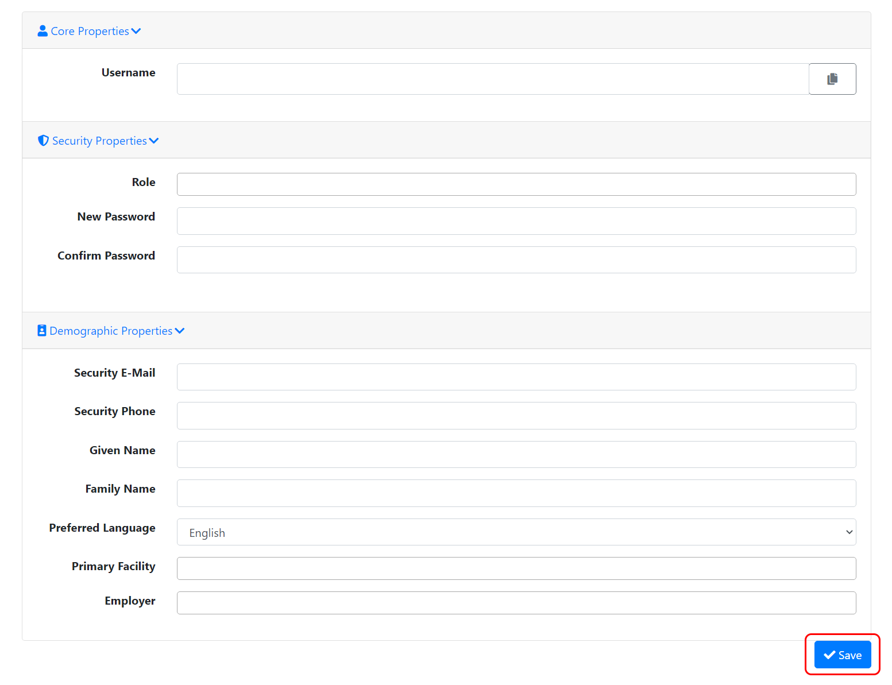
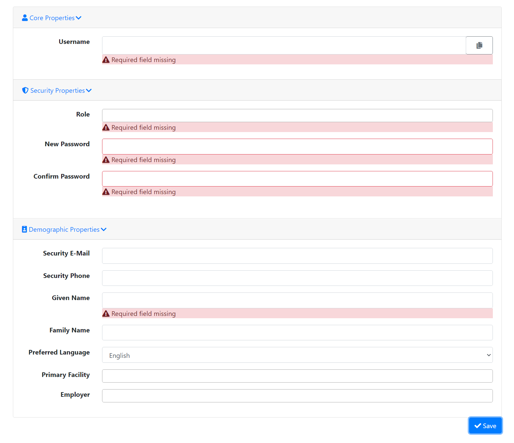

# TEST: SECURITY-UM-02

## References

* [User Management](../../../../../operations/security-administration/user-management.md)
* [TEST: SECURITY-UM-01](test-security-um-01.md)

## Discussion

Some of the properties are specifically required to successfully create a new user. This test verifies that the correct required fields have a prompt with a validation message when the following fields are not specified:

* Username
* Role\(s\)
* New/Confirm Password
* Given Name\(s\)

## Pre-Conditions / Setup

1. User must be logged into an account with policies granted for creating users.
2. Navigate to **Administration Panel / Security / Users / Create User** by clicking the **Create** button on the **Administration Panel / Security / Users / Index** page.

## Actions/Steps

1. Click the **Save** button.   

## Expected Behaviour

* No user should be created.
* Remain on **Administration Panel / Security / Users / Create User** page.
* Display a prompt below each required property textbox with a validation message as follows:

