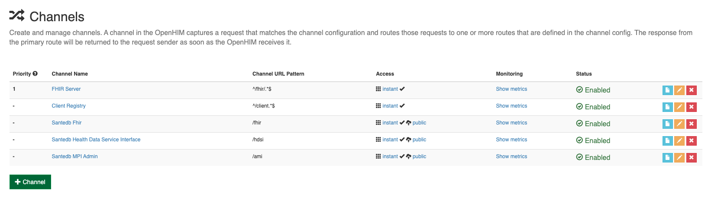
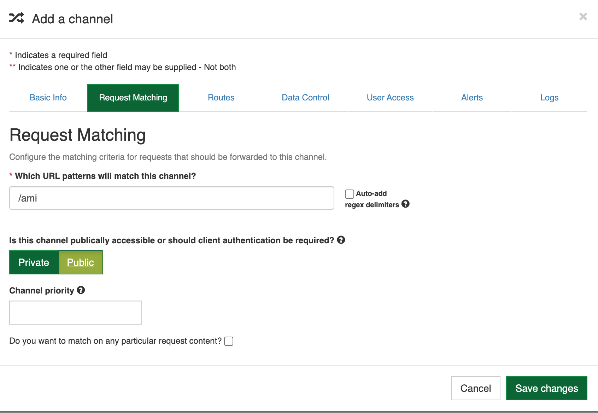
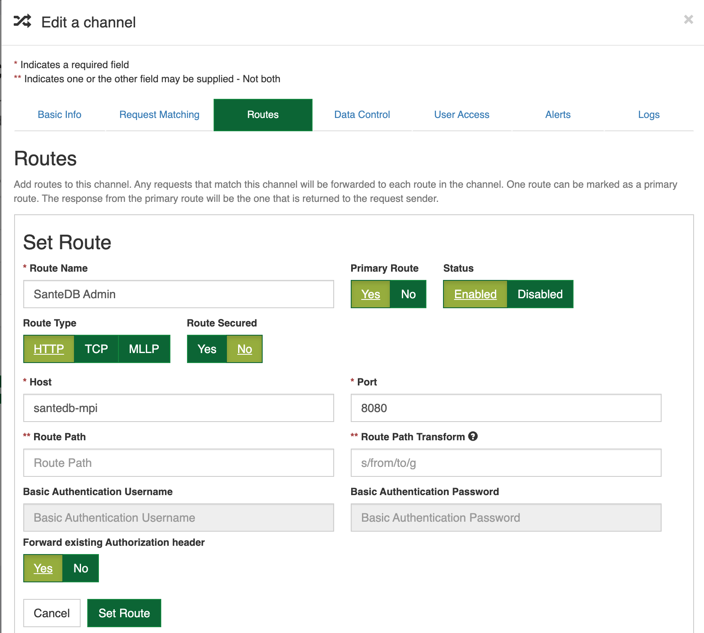
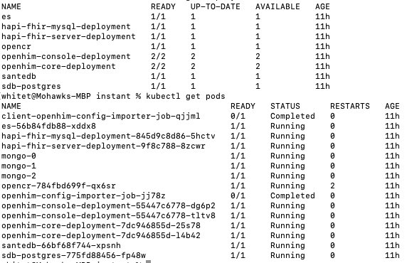
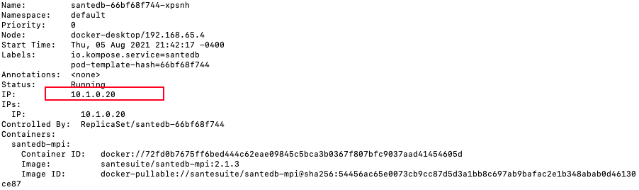
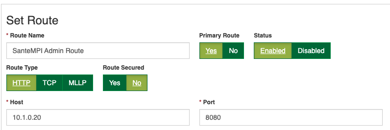
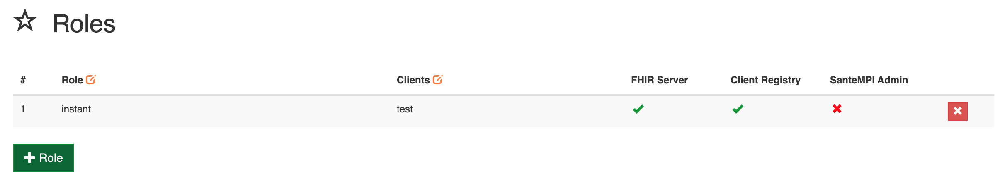
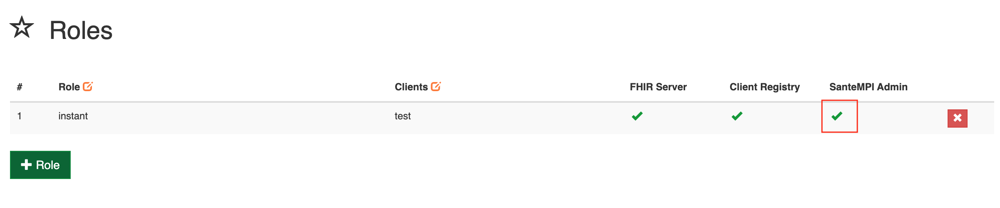
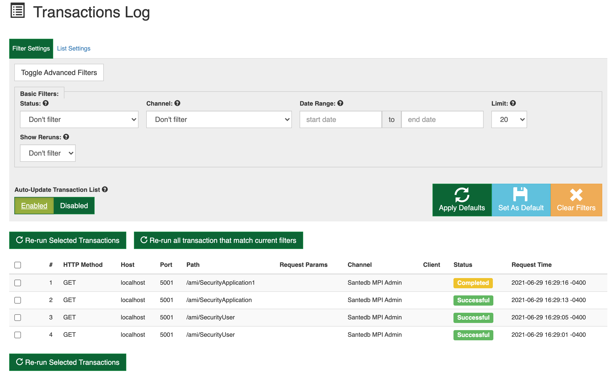

# SanteDB within Instant OpenHIE

## Creating a Santedb package

### Pre-requisites:

* Clone the openhie/instant repo: [https://github.com/openhie/instant](https://github.com/openhie/instant)
* Have docker installed - There is a prerequisite documentation on the openhie wiki which explains the docker requirements: [https://openhie.github.io/instant/docs/introduction/getting-started](https://openhie.github.io/instant/docs/introduction/getting-started)
* Be familiar with how to create an Instant OpenHIE package: [https://openhie.github.io/instant/docs/how-to/creating-packages](https://openhie.github.io/instant/docs/how-to/creating-packages)


Example project can be found at: [https://github.com/santedb/santempi-openhie-package](https://github.com/santedb/santempi-openhie-package)


### Create a fresh SanteDB Package

The minimum needed to create a package is an instant.json file, a Docker folder, and a Kubernetes folder. The instant.json file will look something like shown below.  



```
{
    "id": "santempi",
    "name": "client-registry",
    "description": "OpenHIE CR Based on SanteMPI",
    "type": "infrastructure",
    "version": "v2.1.3",
    "dependencies": ["client", "core"]
 }
```



####  Docker Folder

The docker folder will need the following items: 

* A **compose.sh** file 
* A **docker-compose.yml** file 
* Either **docker-compose.config.yml** files and/or a **docker-compose.dev.yml** file
* Potentially an **Importer** folder, which while not necessarily required, will make life easier - this would enable you to preconfigure channels, instead of having to manually create them. 

#### Kubernetes Folder

The Kubernetes folder will need the following items:

* A **k8s.sh** file
* Kubernetes resource files, in our example we have:
  * **db-deployment.yaml**
  * **db-service.yaml** \(These are for the Postgres Image\)
  * **santedb-deployment.yaml**
  * **santedb-service.yaml** \(This are for the santedb-mpi image\)
  * **santedb-mpi-app-persistentvolumeclaim.yaml, santedb-mpi-config-persistentvolumeclaim.yaml, santedb-mpi-seed-persistentvolumeclaim**
* Potentially an **Importer** folder, which while not necessarily required, will make life easier - this would enable you to preconfigure channels, instead of having to manually create them. 


More information on the importer folder can be found: [https://openhie.github.io/instant/docs/how-to/configure-openhim-mapping-mediator](https://openhie.github.io/instant/docs/how-to/configure-openhim-mapping-mediator)


## Running the SanteDB Package

### Run on Docker

Navigate to the OpenHIE/Instant repository. Type the following commands

```text
yarn
yarn docker:build
```

Next we need to run the images

```text
yarn docker:instant init -t docker santempi -c="<path to santedb package>"
```

The above command is specifying to run docker, specifying the package santempi \(Which will link to the **id** property of the instant.json file\), and specifying a path of where to find the image. 

It make take several minutes to build. And after it's complete, you may need to wait a couple more minutes for the santedb-mpi server to be fully initialized. Once it's done, you should see something that looks like the following:

```text
whitet@Mohawks-MBP instant % docker container ls
CONTAINER ID   IMAGE                              COMMAND                  CREATED              STATUS              PORTS                                                                                                                                                                     NAMES
58d391d05922   santesuite/santedb-mpi:2.1.3       "mono /santedb/Sante…"   33 seconds ago       Up 28 seconds       0.0.0.0:2100->2100/tcp, :::2100->2100/tcp, 0.0.0.0:8082->8080/tcp, :::8082->8080/tcp                                                                                      santedb-mpi
c27b8358cd41   hapiproject/hapi:v5.2.1            "catalina.sh run"        57 seconds ago       Up 54 seconds       8080/tcp                                                                                                                                                                  hapi-fhir
3056b77f1a9b   mysql:5.7                          "docker-entrypoint.s…"   About a minute ago   Up 57 seconds       3306/tcp, 33060/tcp                                                                                                                                                       hapi-mysql
161a5071d2ca   jembi/openhim-core:5               "docker-entrypoint.s…"   About a minute ago   Up 47 seconds       0.0.0.0:5000-5001->5000-5001/tcp, :::5000-5001->5000-5001/tcp, 0.0.0.0:5050-5052->5050-5052/tcp, :::5050-5052->5050-5052/tcp, 0.0.0.0:8080->8080/tcp, :::8080->8080/tcp   openhim-core
8903414d9b11   mongo:4.2                          "docker-entrypoint.s…"   About a minute ago   Up About a minute   27017/tcp                                                                                                                                                                 mongo-1
c1e4e3e15802   postgres                           "docker-entrypoint.s…"   22 hours ago         Up 33 seconds       5432/tcp                                                                                                                                                                  sdb-postgres
7874397ec2ae   intrahealth/opencr:6195bd8         "/bin/sh -c 'dockeri…"   22 hours ago         Up 37 seconds       0.0.0.0:3004->3000/tcp, :::3004->3000/tcp                                                                                                                                 opencr
e42421df077c   intrahealth/elasticsearch:latest   "/usr/local/bin/dock…"   22 hours ago         Up 42 seconds       0.0.0.0:9200->9200/tcp, :::9200->9200/tcp, 9300/tcp                                                                                                                       es
b79d9cd172fd   jembi/openhim-console:1.14         "/docker-entrypoint.…"   22 hours ago         Up 55 seconds       0.0.0.0:9000->80/tcp, :::9000->80/tcp                                                                                                                                     openhim-console
d2a1eb344eee   mongo:4.2                          "docker-entrypoint.s…"   22 hours ago         Up About a minute   27017/tcp                                                                                                                                                                 mongo-2
a53e45cd7c94   mongo:4.2                          "docker-entrypoint.s…"   22 hours ago         Up About a minute   27017/tcp                                                                                                                                                                 mongo-3
whitet@Mohawks-MBP instant % 

```

There are other containers available. These are the minimum required to use the santedb package with the instant openhie project.

You can navigate to http://localhost:9000 and be brought to the login screen. 

* default username is: root@openhim.org
* default password is: instant101

#### Channels - If using the example project

If you've used the example project, or have used an Importer, you should be able to see santedb channels. 



#### Channels - If creating manually

If you are creating a channel manually, click on the green **+ Channel** near the bottom left. 

For **basic info** give a channel name, and a brief description. In this example we are going to use the admin API, so you could call the channel **Santedb MPI Admin**

For r**equest matching** there are two things you need to do

* enter a URL pattern \(in our case **/ami**\) - make sure you unclick Auto-add regex delimiters
* Make the channel public



Finally, for **Routes**, add a new route with the following info:

* Route Name: SanteDB Admin
* Host: santedb-mpi \(this is referencing the docker container name\)
* Port: 8080 \(this is referencing the **internal** docker port on the container\)
* Forward existing Authorization Headers: yes

Click set route. 



#### 

### Run on Kubernetes

Navigate to the OpenHIE/Instant repository. Type the following commands

```text
yarn
yarn docker:build
```

Next we need to run the images

```text
yarn docker:instant init -t k8s santempi -c="<path to santedb package>"
```

The above command is specifying to run docker, specifying the package santempi \(Which will link to the **id** property of the instant.json file\), and specifying a path of where to find the image. The only difference between this and docker, is you're changing the keyword 'docker' to 'k8s'.

The kubernetes deployments will take much longer to build than the docker deployments. Afterwards it will look something like the following image \(Note: This might change depending on what packages you're running\)



You can navigate to http://localhost:9000 and be brought to the login screen. 

* default username is: root@openhim.org
* default password is: instant101

**Manually Adding Channels**

To manually add a santedb channel, once logged in, click on the channel section and the green **Channel +** button. 

Adding a channel is almost identical to docker. \(See above\) - The differences is when adding a route, instead of using the container name, as in docker, you will need to use the IP Address of the pod. 

To obtain the pod:

```text
kubectl get pods
```

The pod we want is the santeDB pod, **santedb-66bf68f744-xpsnh** \(This will change as the name is dynamic, but it should be prefixed with santedb\)

```text
kubectl describe pod santedb-66bf68f744-xpsnh
```

The above command will display the details of this pod. At the top of the JSON blob you can see the IP Address.



Now you can add the IP Address as the **host** for the route.



One quick note when manually adding channels, you may need to check to ensure the role has permission to access the channel. You can check by clicking on the **Clients** tab on the left hand side. Check the role you are attempting to use, if you see an X over the santedb channels, you can click the **x** and it will change the permission.

 





## Testing, and viewing transactions

We will now test to make sure we can see SanteDB transactions in openHIM. You will need to generate a bearer token in order to successfully access santedb services. We will test with an administrator account, so we will be using the SanteMPI Admin Channel. 

**To generate a bearer token:**

You can follow this link: [http://localhost:8082/auth/authorize/?redirect\_uri=http://google.com&client\_id=fiddler&scope=openid%20\*&response\_type=token&response\_mode=query&state=foo](http://localhost:8082/auth/authorize/?redirect_uri=http://google.com&client_id=fiddler&scope=openid%20*&response_type=token&response_mode=query&state=foo)

This is using the running santedb-mpi container, externally from openhim, and generating a token. It will take you to a login page. Enter the account credentials of the account you want to test with \(in our case, Administrator\)

* username: Administrator
* password: Mohawk123

You will be redirected to a blank page, where you can copy the bearer token from the url.


### Testing the channels

To test we are going to make API calls using something like **Postman**, or maybe **curl.** For this demo I will use postman. 

Under the **Authorization** tab for postman, select type as **Bearer Token** - In the value, enter the bearer token that you have generated. 

We are going to make a simple **get** request using [http://localhost:5001/ami/SecurityUser](http://localhost:5001/ami/SecurityUser)


We're targeting port 5001 here, as this is one of the ports open in the openhim-core container. If successful, our request should redirect through the openhim-core, to santedb. And a transaction should have been created. 


You should see a 200 response. Now, go back to the OpenHIM console. You should see transactions being displayed. It will look similar to the image below:




#### Congratulations, you have now verified your santedb package within the instant openhim!

