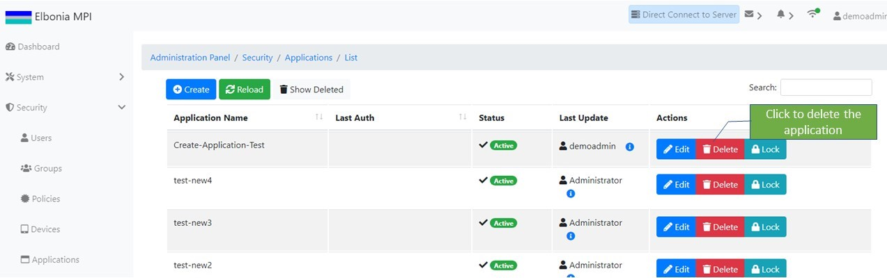

# Application Management

## Application Identity

When an authentication request is made against the Access Control System, depending on the type of authentication request the ACS will call the identity providers to authenticate the identity information provided.

## Creating A New Application

If you wanted to create a new application, you could select the **Create** button.

 You'll then be presented with the new Create Application screen. Fill out the fields appropriately and click the **Save** button. \( Name and Sofware Name are required fields and must be filled out\).

  
Once created:‌

* The apllication can be locked/unlocked
* A policy can be assigned to the application
* The application can be deleted/undeleted

## Locking/Unlocking An Application

If you wanted to lock an application you could select the **Lock** button:

  
when an application is locked the status will change to "Locked" and it can be unlocked by selecting the **Unlock** button.

## Assigning Policies To An Application

In order to assign a policy to an application you should click the **Edit** button:

  
then go to the **Associated Policies** tab, choose the policy you wish to add from the drop-down list, and click the **+** button**:**

## Deleting/Un-Deleting A**n Application**

In order to delete an application you should click the **Delete** button:

To un-delete, click the **Show Deleted** button to go to the deleted applicatins screen and then click the **Un-Delete** button.

