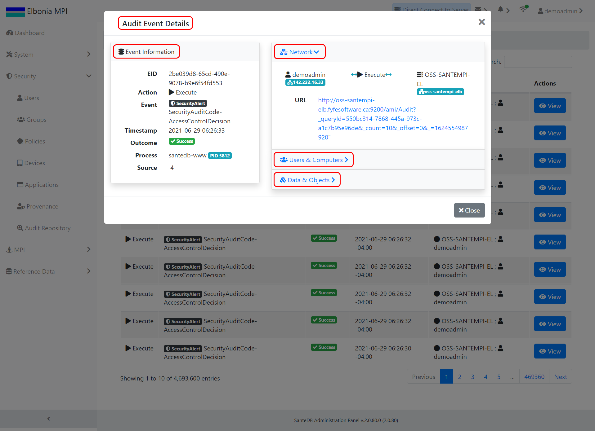
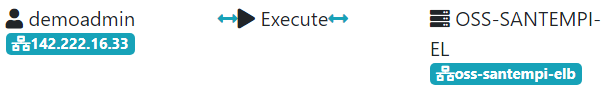

# Audit Repository

## Purpose of Audits

Auditing represents official inspection of user accounts. SanteSuite logs **timestamped** **events** that occur when **actors** perform **actions** within the application that may result in various **outcomes**. 

## Reviewing Audits

Audits can be sorted and filtered by:

* **Action** - can be Execute, Create, Read, Update, Delete depending on an event action.
* **Event** - can be Security Alert, Authentication, Import Data, Export Data, or Query depending on what an actor does in the application that is being logged for auditing.
* **Outcome** - can be Success, Minor/Moderate Fail, Serious Fail, ui.model.audit.outcome.epic

Additional details are provided when viewing an audited event \(by clicking a 'View' button in the 'Actions' column\) with details about the:

1. Event Information
2. Network
3. Users & Computers
4. Data & Objects

### Event Information

| Label | Description |
| :--- | :--- |
| EID |  |
| Action |  |
| Event |  |
| Timestamp |  |
| Outcome |  |
| Process |  |
| Source |  |

### Network

The following network diagrams show how each may differ depending on the event action: 

| Label | Description |
| :--- | :--- |
| URL |  |

### Users & Computers

| Label | Description |
| :--- | :--- |
| User Name |  |
| Machine |  |
| R |  |
| Roles |  |

### Data & Objects

| Label | Description |
| :--- | :--- |
| Type |  |
| LC |  |
| Role |  |
| ID |  |

