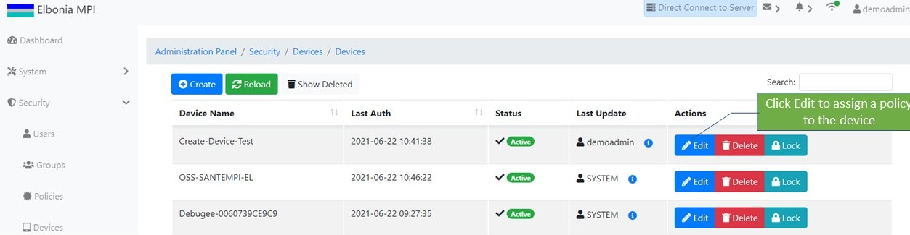

# Device Management

## Creating A New Device

If you wanted to create a new device, you could select the **Create** button. 

You'll then be presented with the new Create Device screen. Fill out the fields appropriately and click the **Save** button. \( Name, Model Name, and Operating System are required fields and must be filled out\).

Once create

* The device can be locked/unlocked
* Device Secret can be changed\(reset\)
* A policy can be assigned to the device
* The device can be deleted/undeleted

## Locking/Unlocking A Device

If you wanted to lock a device you could select the **Lock** button:

when a device is locked the status will change to "Locked" and it can be unlocked by selecting the **Unlock** button.

## Changing Device Secret

If you wanted to change the Device Secret you should select the **Edit** button:

Then click the Device Secret **Reset** button to reset the Device Secret:

## Assigning Policies To A Device 

In order to assign a policy to a device you should click the **Edit** button:

then go to the **Assigned Policies** tab,  choose the policy you wish to add ****from the drop-down list and click the **+** button**:**

## Deleting/Un-Deleting A Device

In order to delete a device you should click the **Delete** button:

To un-delete, click the **Show Deleted** button to go to the deleted devices screen and then click the **Un-Delete** button.

