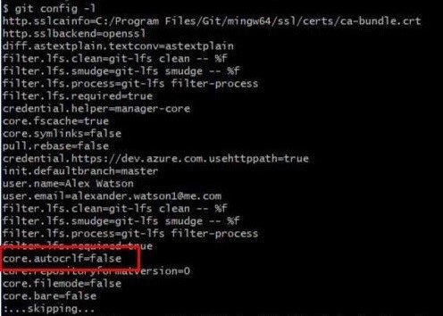
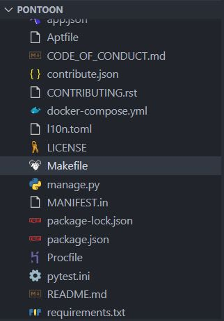
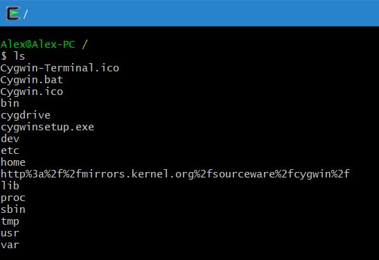
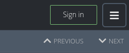
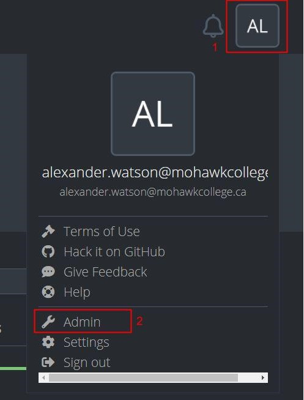
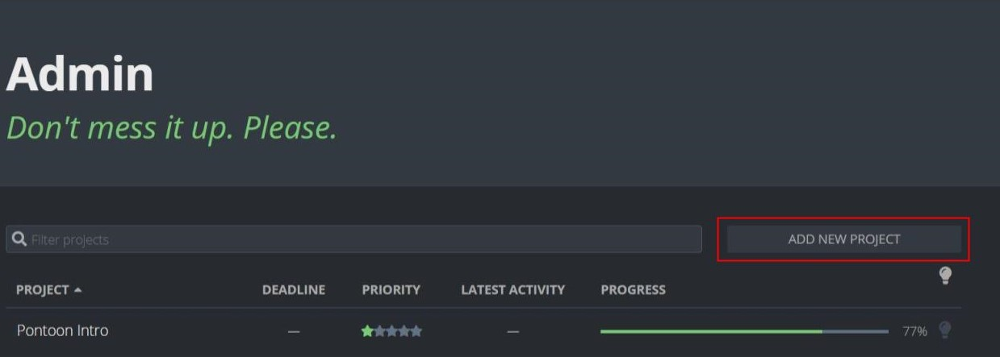
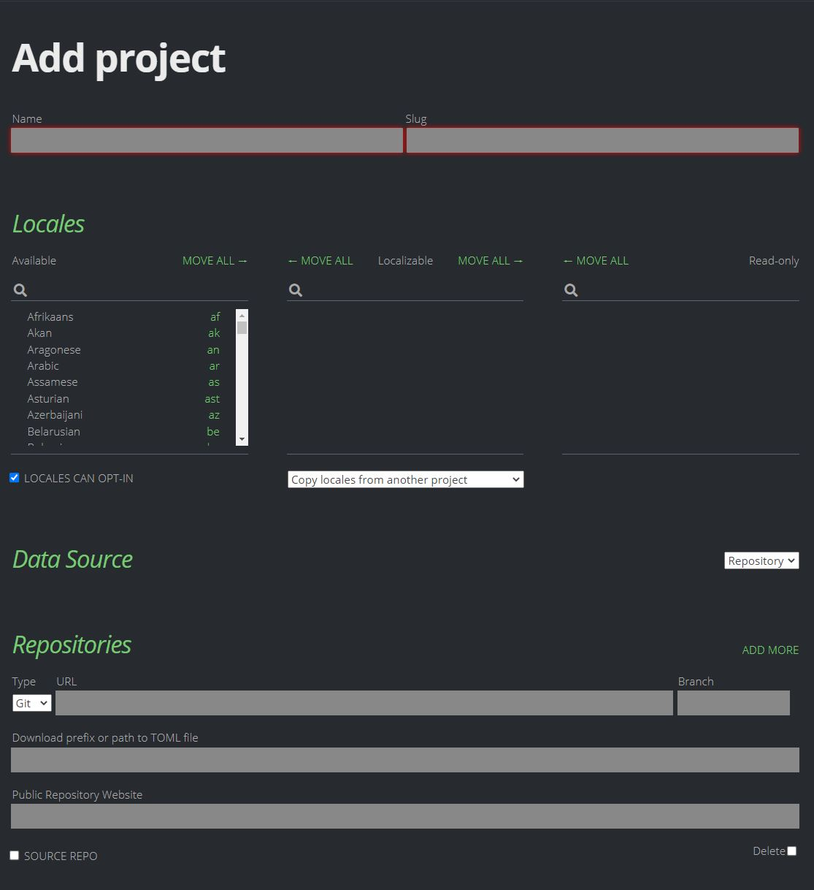
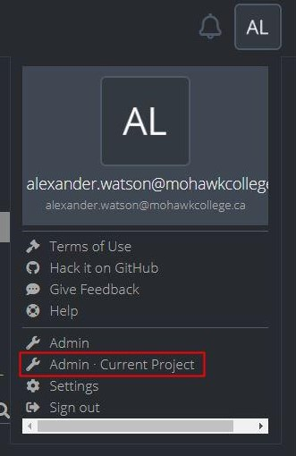
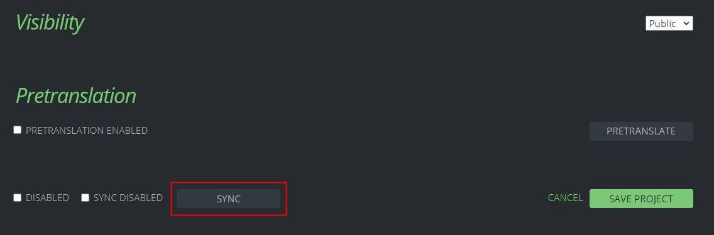

# Pontoon

## **What is Pontoon**

[Pontoon](https://mozilla-pontoon.readthedocs.io/en/latest/index.html) is used to translate strings of your app for another locale. This is done by creating a Pontoon project which creates an interface for others to select strings from the project you wish to have translated and translate them into a specific language. These translations are then verified by an admin and are synched back into the base project, in this case SanteMPI.

Your pontoon instance should be forked from the Mozilla repository and set up in a git account seperate from the project whose strings you wish to have translated. This is because Pontoon will be acting as a “contributor” to the base project and making “commits” in the form of translations during a sync. 

## **Getting Set Up**

* Install Docker and docker-compse \(1.10 or higher \)
* Open Power Shell as Admin to download Chocalty
* Input the command shown below to install Chocolaty


```text
Set-ExecutionPolicy Bypass -Scope Process -Force; [System.Net.ServicePointManager]::SecurityProtocol = [System.Net.ServicePointManager]::SecurityProtocol -bor 3072; iex ((New-Object System.Net.WebClient).DownloadString('https://community.chocolatey.org/install.ps1'))
```


* Install **Make** and **Cygwin** by entering the following command


```text
choco install make git cygwin
```



**Before** cloning your Fork of Pontoon a change needs to be made your core.autocrlf. This needs to be disabled in order for the Pontoon docker image to build correctly. 


Open up **Power Shell** as **Admin** and enter the following commands:

```text
git config --system --unset core.autocrlf
```

```text
git config --global core.autocrlf false
```

Verify that the core.autocrlf is set to false as shown below with the following command:

* git config -l



## **What is Make and Cygwin**

### **Make**

**Make** is ****a tool from the GNU family of software which controls the generation of executables and other non-source files of a program from the program's source files. 

**Make** gets its knowledge of how to build your program from a file called the makefile, which lists each of the non-source files and how to compute it from other files. When you write a program, you should write a makefile for it, so that it is possible to use Make to build and install the program. You can see the make file in the Pontoon code base as seen below.  




###  Cygwin

**Cygwin** is a [POSIX](https://en.wikipedia.org/wiki/POSIX)-compatible programming and [runtime environment](https://en.wikipedia.org/wiki/Runtime_environment) that runs natively on [Microsoft Windows](https://en.wikipedia.org/wiki/Microsoft_Windows). Under Cygwin, [source code](https://en.wikipedia.org/wiki/Source_code) designed for [Unix-like](https://en.wikipedia.org/wiki/Unix-like) operating systems may be compiled with minimal modification and executed. 

The Cygwin terminal will be used a terminal to interact with the **Pontoon** code base to 

* **Build**
* **Run**
* **Setup**

When opening **Cygwin** you will be in an empty directory. Back out of this directory 2 levels:

* **cd ../../**



Navigate to **cygdrive** and then the **C** drive:

* **cd cygdrive/c**

From there you will be able to navigate to the root directory of your local **Pontoon** code base.

## Running a Local Instance

In order for Pontoon to find the source strings that need to be translated, they need to be stored in a folder called “**locales**”. Inside this folder the strings for translation should also be in a folder with the designated locale identifiers as the folder name\( en, fr, es \). This is where the file with the source strings is located and can be one of these supported file types. 

* .dtd
* .ftl
* .inc
* .ini
* .json
* .lang
* .po
* .properties
* .xliff.
* .xml

When synching, **Pontoon** will place the translations into the correct folders. Pontoon can read from a single source or multiple source files as long as they are in the same folder.


Remember to make the github account with the pontoon instance being run a contributor to the project being translated.


Heres is an example of a correct folder structure:

```text
locales/{locale_code}/path/to/file.extension
```

## Starting Pontoon

Using **Cygwin Terminal** navigate to the root of your local instance of **Pontoon**. If it is the first time starting Pontoon run: 

* make build

When this is complete run:

* make run

This will start Pontoon. Navigate to **localhost:8000** to interact with it.  


## Create and Admin Account

In order to generate new projects we will need an Admin account.

Open another **cygwin terminal** and navigate to the root folder of your local Pontoon instance.

Run:

* **make setup**

Follow the prompts on screen and enter your information to create the admin account.  
Click the Sign In button at the top right of the screen and login with the admin user you just created.  




## Creating a Project On Pontoon

After Sign In, click the user Icon in the top right of the screen to reveal the drop down menu and click the **“Admin”** option.



On the Admin Page, select "**Add New Project"** on the right side of the page.  




You will be presented with the following screen. Fill in the selections shown below.



* Give it s Project Name\(slug will autofill\)
* Find and select the locales you want and move them into the **“Localizable”** column
* Fill in the URL to the to repository or the project you want translate
* Add the link to the path where the principle files you wish to translate. If there are more than one, use 2 wildcards\(\*\*\). Be sure to replace any locale identifier with **{locale\_code}**
  * Eg: github\_repo.../locales/**{locales\_code}**/path/to/file.extension
* Public Repository Website is simply the same as **URL** but without the **.git** at the end

When this is filled out scroll to the bottom of the page

* Make the project **public** and click **Save**
* Wait for the page to reload and then scroll to the bottom and click **“Sync”**

  
Verify that the project strings are pulled by navigating to **“Projects”** at the top of the page and then selecting one of the **Localizations** you added to the project. Inside here you should see the string files that are to be translated.

## Synching Translations

In order to sync translation to the project, the GitHub user that is hosting the **Pontoon Repository** must have a [**Personal Access Token\(PAT\)**](https://docs.github.com/en/github/authenticating-to-github/keeping-your-account-and-data-secure/creating-a-personal-access-token) generated by their GitHub account. This will be used as the password for the account when synching.  
In order to sync accepted translations for the project, navigate to it inside Pontoon and click on the User Icon in the top right and then select **“Admin Current Project”** as shown below.



Scroll to the bottom of the page and select **"Sync"** as shown in the image below.



Switch to the **Cygwin Terminal** to continue the sync.

* Enter the GitHub **Username** of the Pontoon account
* Enter the PAT when asked for the account **Password**

You will be notified that the sync has been completed. 

Check in the project GutHub to confirm that the repository has been updated.

