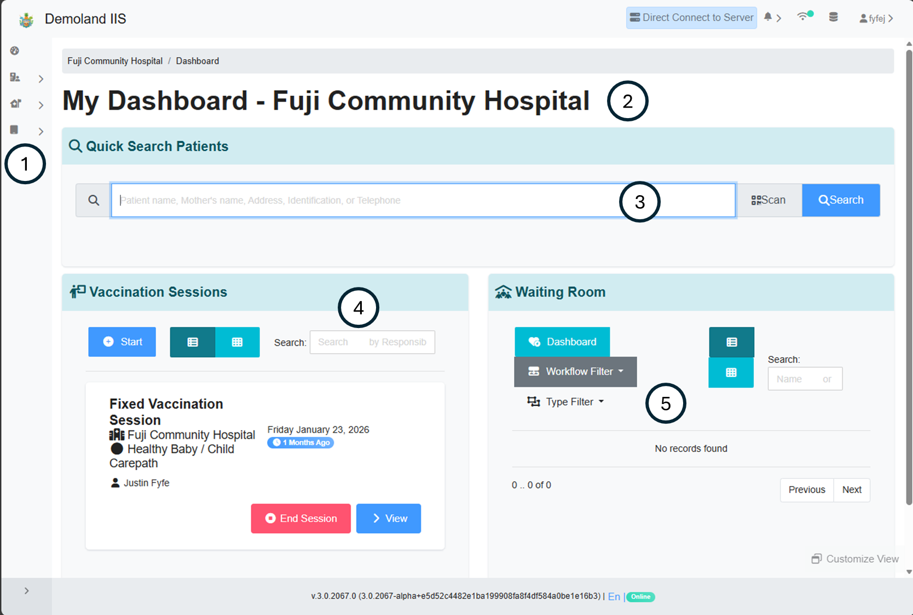

# EMR Clinical Portal


This section documents features available when the SanteEMR plugins are enabled on the iCDR in SanteDB 3.0 or later.


The EMR Clinical Portal allows clinical users (those who are CLINICAL\_STAFF role) access to functions in the EMR. The EMR clinical portal allows users to:

* Manage Patient Populations - Searching, registering, and viewing patient records
* Visit Management - Including check-in, moving the patient about the clinic, waiting room management, and discharge.
* Clinic Schedule - Based on the care pathways for the clinic the calendar of the clinic's activities.

When the SanteIMS plugins are installed in addition to the SanteEMR plugins the following extended functions are enabled:

* Managing clinic stock stores & balances
* Reporting on refrigerator temperatures & functional monitoring
* Start and manage vaccination sessions

## Logging In

The login screen is typically customized for the country which is deploying the EMR solution. SanteEMR can operate in three different ways:

* As a web-portal servicing the entire jurisdiction
* As a disconnected gateway - acting as a federated access point where reliable internet may not be available
* As a standalone app - acting for one facility

When SanteEMR is operating as a web-portal or as a gateway (where it is servicing multiple facilities) the clinical users will automatically be logged into their dedicated facility. However, when the user is assigned to multiple facilities (such as relief staff) they will be prompted for their facility of operation during login.

<figure><figcaption></figcaption></figure>

## Clinical Dashboard

Depending on the access credentials of the logged in user, the personalized dashboard of the user. The dashboard allows for rapid access to common functions in the EMR.

<figure><figcaption></figcaption></figure>

1. Menu - By default the menu is minimized, hovering over the menu or swiping right from the left hand side of the screen will expand the menu.
2. Current Facility - Identifies the facility in which the current user's session is operating
3. Patient Search - Allows the user to rapidly search for patients by their name, address, relative's names, telephone number, or an identifier.
   1. If the search criteria exactly matches the pattern of an identity domain, and one result is located, the user is taken directly to the patient's detail screen.
4. Vaccination Session Management (IIS Only) - Allows the user to quickly search, manage, or start a new vaccination session.
5. Waiting Room - A list of patients which are currently checked-in to the clinic
